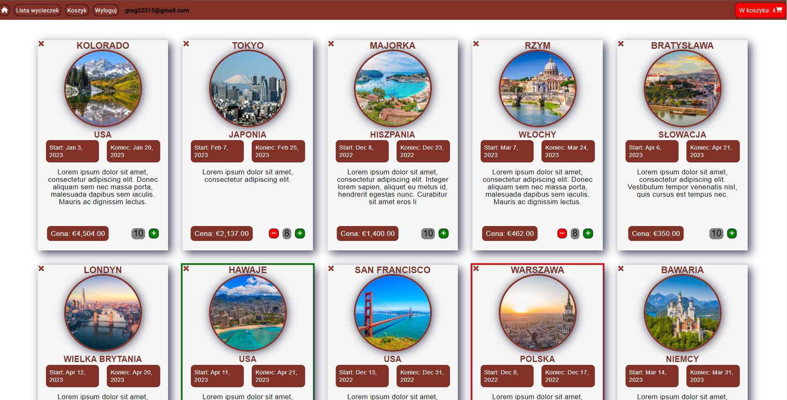
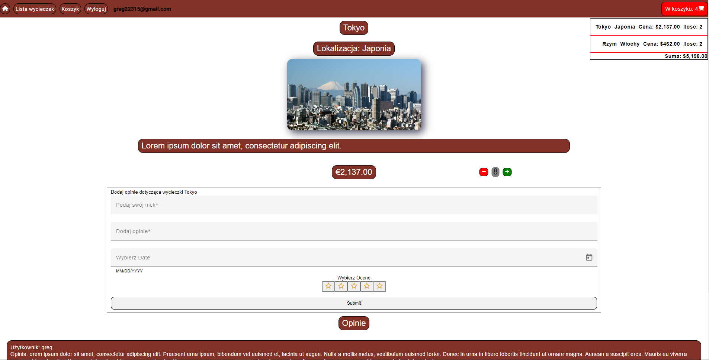
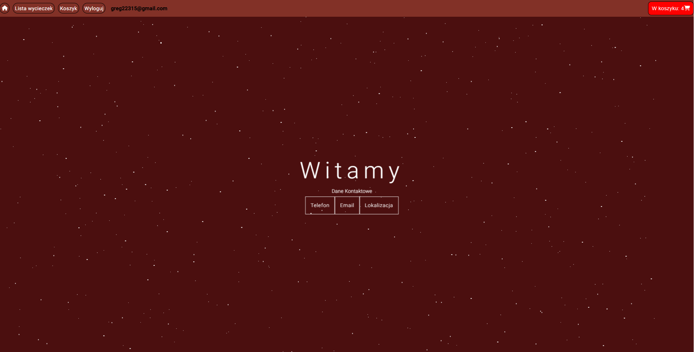

## Website for Travel Agency
This website was made using Angular and it is a part of the Introduction to web application course at AGH UST.
Backend is made with Firebase Firestore Database. [Source code can be seen here](https://github.com/greg282/introduction-to-web-applications/releases/tag/lab6)

## Functionality
* Making purchases
* Registering new users
* Roles for Users: Admin,Client and Manager
* Banning users
* Adding reviews for each tour
* Trip manager view for manager
* Admin panel for managing users
* Shopping cart

## Screenshots

  

  

  

